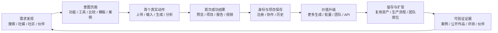
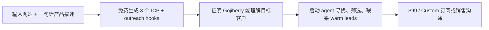
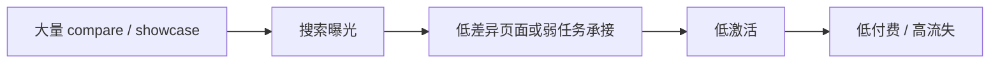
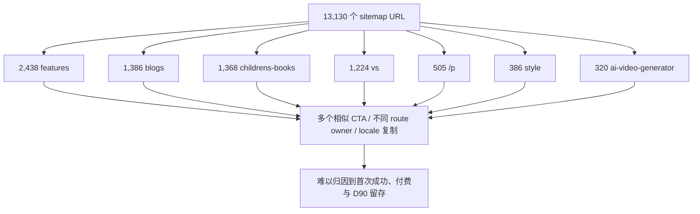
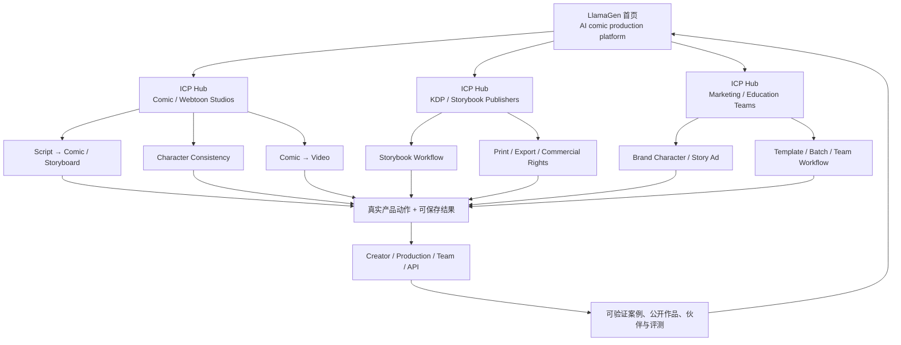

# TrustMRR 创意 AI 竞品 SEO、外链与商业增长报告

日期：2026-07-30  
对照产品：LlamaGen.AI  
研究范围：AI 视频、图片、漫画、设计、艺术创作与市场营销工具  
收入口径：TrustMRR 公开支付服务商快照；同步时间集中在 2026-07-29 20:08 UTC 至 2026-07-30 00:52 UTC  
SEO 口径：公开、未登录抓取首页、`robots.txt`、sitemap、`llms.txt`、`ai.txt`；详见同目录原始数据和抓取器

## 一、结论先行

### 1. LlamaGen 现在不缺页面，缺“能产生留存收入的页面组合”

本轮抓取发现：

- LlamaGen sitemap 已有 **13,130 个 URL**。
- 其中 `/features` 2,438 个、`/blogs` 1,386 个、`/childrens-books` 1,368 个、`/vs` 1,224 个。
- LlamaGen 首页已经有一个 H1、较完整的 Organization / SoftwareApplication / WebSite 等结构化数据、117 个唯一站内链接和可访问的 `llms.txt`。

所以，接下来继续大批量创建相似关键词页，预期收益很低，反而可能继续增加：

- 抓取预算和索引稀释；
- locale / canonical / hreflang 维护成本；
- 模板重复和 doorway-page 风险；
- 用户从搜索落地到真正使用产品的距离；
- 团队无法判断哪个页面真正带来付费和 D30 / D90 留存。

最关键的对照是：

| 产品 | sitemap URL | 当前 MRR | 结论 |
| --- | ---: | ---: | --- |
| [Vid.AI](https://trustmrr.com/startup/vidai-llc) | 11 | $77,702 | 高收入并不要求大规模 SEO |
| [GojiberryAI](https://trustmrr.com/startup/gojiberryai) | 54 | $500,206 | 窄 ICP、免费工具和强分发可以远胜页面数量 |
| [Laper](https://trustmrr.com/startup/laper) | 155 | $21,885 | 专业工作流、清晰定位和多渠道发布比 DR 更重要 |
| [AI Designer](https://trustmrr.com/startup/ai-designer) | 86 | $9,971 | 少量高质量产品页、模板、社区证明可以有效成交 |
| [ComicsAI](https://trustmrr.com/startup/comicsai) | 2,640 | $319 | pSEO 规模没有转化成收入 |
| [GenVideo AI](https://trustmrr.com/startup/genvideo-ai) | 472 | $0 | 多语言、showcase 和目录外链不等于 PMF |
| **LlamaGen** | **13,130** | 未使用 TrustMRR 口径 | 页面规模已不是主要短板 |

### 2. 最值得学习的六个样本

按对 LlamaGen 的学习价值排序：

1. **Laper**：学习“一个专业职业人群 + 完整创作工作流 + 清晰反 AI 味定位 + 免费到 $400/月的升级路径”。
2. **Vid.AI**：学习创作者结果证明、强 offer、高客单价和 YouTube / affiliate 分发，而不是学习它的 SEO 技术。
3. **AI Designer**：学习真实产品入口、模板库、社区反馈、MCP 场景和“生成结果不显得像 AI”的明确敌人。
4. **GojiberryAI**：学习高意图免费工具如何直接接入主产品，而不是把免费工具做成与收入脱节的流量孤岛。
5. **Cometly**：学习 integration、solution、academy、customer proof 如何共同支撑高 ARPU B2B 成交。
6. **Videotok**：学习 compare、free tools、guides、use cases 与 managed service 的完整内容阶梯。

不应作为成功样板：

- **Produce.so**：当前 MRR $27,371，但最近 30 天收款为 $0，且历史总收入只有 $26,981，内部口径明显矛盾。
- **Make Design**：625 个 URL、MRR 只有 $321；增长百分比受极小基数影响。
- **ComicsAI**：2,640 个 URL、MRR 只有 $319。
- **GenVideo AI**：472 个 URL、DR 23、30 多个目录链接，但 MRR 为 $0。
- **Nutshellapp**：曾有数千索引页和约 7 万月度自然访问的卖家说法，但现在网站无法抓取、MRR 为 $0。

### 3. 对 LlamaGen 的核心建议

未来 90 天应把增长资源从“扩页”切换到以下五件事：

1. **按收入和留存治理 13,130 个 URL**：选择、合并、改造、noindex 或退出，而不是默认全部继续索引。
2. **把 5–10 个高意图页面变成真实产品入口**：用户在首屏上传脚本、定义角色、选择模板或生成一次可见结果。
3. **建立三个可独立成交的 ICP 入口**：漫画 / Webtoon 制作团队、KDP / 儿童书出版者、营销 / 教育内容团队。
4. **用 6 个可核验案例替代大量弱社证**：公开身份或作品、输入、流程、输出、前后指标和限制。
5. **把 SEO、外链和商业数据接到同一漏斗**：落地页 → 第一个产品动作 → 首次成功 → 注册 → 导出 → 付费 → D30 / D90 留存贡献毛利。

## 二、研究方法与数据边界

### 2.1 TrustMRR 收入能证明什么

[TrustMRR FAQ](https://trustmrr.com/faq)说明，收入通过支付服务商只读 API 同步，通常按小时更新。公开档案中的收入、MRR 和订阅数因此比创始人手工截图更可信。

但是 TrustMRR 同时披露：

- 因退款、试用、proration 和币种转换，不同公式可能产生最高约 30% 的差异；
- 一个档案可以连接第二个支付服务商；
- 用户数、定价、营销渠道和 startup insights 可以由 AI 生成或由所有者编辑；
- 支付账户里的收入不天然等于页面展示的单一产品收入。

[Spylist 公开页面](https://trustmrr.com/startup/spylist)就是账户归属反例：创始人明确说明，高额历史 Stripe 收入来自同一账户的上一项业务，当前产品实际只收了约 $6。

因此，本报告使用以下可信度分层：

| 判断 | 可信度 |
| --- | --- |
| 所连接支付账户发生了对应规模的交易 | 高 |
| MRR 与订阅数在账户层面大致正确 | 中高 |
| 所有收入只属于页面展示的一个产品 | 中 |
| 收入已扣除退款、税、affiliate、模型与算力成本 | 低 |
| 公开填写的利润率、用户数、渠道归因准确 | 低 |
| 最近增长能够长期维持 | 未知 |

### 2.2 SEO 抓取范围

抓取器执行了以下公开读取：

- 首页状态、最终 URL、title、description、canonical、H1；
- JSON-LD 类型；
- 首页站内链接与外部 host；
- `robots.txt` 和 sitemap 递归发现；
- sitemap URL 数量、一级页面家族和 locale 数量；
- `llms.txt` 与 `ai.txt` 状态。

边界：

- 每站最多读取 40 个 sitemap、20,000 个 sitemap URL；
- 不登录、不绕过验证、不提交表单；
- 首页 HTML 抓取对纯客户端渲染页面可能漏掉渲染后的 H1 和 JSON-LD，Vid.AI 就属于这种情况；
- **从一个网站首页抓到的外部 host 是出站链接，不是入站 backlink**；
- 真正的入站外链来源只能通过搜索发现公开样本。本报告没有伪装成 Ahrefs / Semrush 的完整 referring-domain 导出；
- 外链是否 dofollow、是否付费、是否 reciprocal，需要在实际投放前逐项复核。

### 2.3 TrustMRR 自身的统计信号

[TrustMRR Stats](https://trustmrr.com/stats)显示：

- 全库 67.9% 的产品收入在 $0–$1k；
- Content Creation 类别的中位 MRR 约 $12,754；
- Revenue 与 Domain Rating 的相关系数约 `r=0.43`，不是强因果关系；
- Revenue 与创始人 X 粉丝数相关系数约 `r=0.29`。

这说明 DR、粉丝和收入都有关系，但任何单一 vanity metric 都不足以解释增长。

## 三、收入与商业质量矩阵

以下均为本轮统一读取的公开 Markdown 快照。

| 产品 | 最近 30 天 | MRR | 活跃订阅 | 30 天收入增长 | MRR 增长 | DR | MRR/订阅 | 商业解读 |
| --- | ---: | ---: | ---: | ---: | ---: | ---: | ---: | --- |
| [Produce.so](https://trustmrr.com/startup/produce-so) | $0 | $27,371 | 81 | -100.0% | 0.0% | 5 | $337.91 | 口径严重矛盾，不作收入样板 |
| [Videotok](https://trustmrr.com/startup/videotok) | $3,673 | $4,603 | 129 | -52.6% | -9.2% | 33 | $35.68 | 历史收入强，但当前明显下滑 |
| [Aura AI](https://trustmrr.com/startup/aura-ai-ai-video-image-generator) | $2,425 | $2,394 | 61 | -25.4% | -15.8% | 48 | $39.25 | 跨平台和社媒分发样本，非增长样本 |
| [AI Designer](https://trustmrr.com/startup/ai-designer) | $10,531 | $9,971 | 364 | -4.3% | -7.9% | 26 | $27.39 | 收入和产品结构较平衡 |
| [Make Design](https://trustmrr.com/startup/make-design) | $287 | $321 | 23 | +76.6% | -76.0% | 22 | $13.96 | 小基数波动，不宜放大增长百分比 |
| [Laper](https://trustmrr.com/startup/laper) | $24,963 | $21,885 | 665 | +63.2% | +71.5% | 9 | $32.91 | 当前最值得研究的创作工作流增长样本 |
| [ComicsAI](https://trustmrr.com/startup/comicsai) | $278 | $319 | 24 | -24.3% | -1.8% | 20 | $13.29 | 大规模 pSEO 未变成收入 |
| [Vid.AI](https://trustmrr.com/startup/vidai-llc) | $53,255 | $77,702 | 1,045 | -13.5% | -4.6% | 38 | $74.36 | Offer / creator distribution 强于 SEO |
| [GojiberryAI](https://trustmrr.com/startup/gojiberryai) | $396,801 | $500,206 | 4,699 | +20.6% | +24.3% | 47 | $106.45 | 最强高意图免费工具与销售转化样本 |
| [Cometly](https://trustmrr.com/startup/cometly) | $220,472 | $208,441 | 307 | +20.2% | +4.0% | 70 | $678.96 | 高 ARPU B2B 内容与 integration 样本 |
| [Nutshellapp](https://trustmrr.com/startup/nutshellapp) | $0 | $0 | 0 | -18.1% | 0.0% | 27 | — | 流量不等于可持续产品 |
| [GenVideo AI](https://trustmrr.com/startup/genvideo-ai) | $9.90 | $0 | 0 | -34.0% | -100.0% | 23 | — | 目录与多语言 pSEO 的强反例 |

注意：

- `MRR/订阅`是用于比较商业承接能力的粗算，不是 ARPU 的审计口径。
- 最近 30 天收入可能包含一次性支付，MRR 是经常性收入估算，两者不应混用。
- Produce.so 的 MRR 高于历史总收入且最近 30 天收款为零，说明仅看排行榜卡片可能得出完全错误的结论。

## 四、站点 SEO 框架对比

### 4.1 总体框架图



成功样本的共同点不是“页面很多”，而是每一类页面都能进入这条闭环。弱样本常在 B 停止：获得了页面和 DR，却没有 C、D、F、G。

### 4.2 抓取到的页面家族

| 站点 | sitemap URL | 主要页面家族 | 首页 SEO / 发现 |
| --- | ---: | --- | --- |
| LlamaGen | 13,130 | features 2,438；blogs 1,386；childrens-books 1,368；vs 1,224；p 505；style 386 | 1 H1；丰富 JSON-LD；117 个唯一站内链接；`llms.txt` 200 |
| Produce.so | 5 | pricing、examples、faqs、playbook | 1 H1；Organization / WebSite；`llms.txt` / `ai.txt` 200 |
| Videotok | 354 | compare 132；free-tools 38；blog 36；guides 15；use-cases 15；features 14 | 1 H1；43 个唯一站内链接；4 种主要 locale；`llms.txt` 200 |
| Aura AI | 120 | blog 54；models 18；animate 8；compare / vs 11 | 1 H1；较丰富 SoftwareApplication / Offer / rating schema；`llms.txt` / `ai.txt` 200 |
| AI Designer | 86 | blog 45；templates 21；核心产品页约 10 | 1 H1；FAQ / Offer / SoftwareApplication；30 个唯一站内链接；`llms.txt` 200 |
| Make Design | 625 | compare 301；showcases 253；alternatives 26；tools 19 | 1 H1；较丰富 schema；`llms.txt` / `ai.txt` 404 |
| Laper | 155 | screenplays 54；docs 34；blog 23；features 12；highlights 12；alternatives 6 | 1 H1；丰富 FAQ / Offer / SoftwareApplication；`llms.txt` / `ai.txt` 200 |
| ComicsAI | 2,640 | style 560；blog 400；model 256；format 240；大量工具 dashboard | 1 H1；丰富 schema；多语言；`llms.txt` / `ai.txt` 200 |
| Vid.AI | 11 | tools 3；pricing、changelog、基础页面 | 初始 HTML 为客户端壳，抓取器未看到 H1 / schema；`llms.txt` 404 |
| GojiberryAI | 54 | 英法各 27；ICP / persona / outreach 等免费工具和资源 | 首页 16 个 H1、无解析到 JSON-LD；技术并不完美 |
| Cometly | 5,727 | post 5,338；integration 206；academy 34；customers 29；solutions 16 | 1 H1；95 个唯一站内链接；`llms.txt` 200 |
| Nutshellapp | 0 | 当前无法连接 | 当前不可抓取 |
| GenVideo AI | 472 | showcase 280；视频 / 图片工具各 10 个 locale 版本 | 1 H1；FAQ / WebPage schema；`llms.txt` / `ai.txt` 200 |

## 五、最值得研究的网站逐项分析

### 5.1 Laper：专业工作流和定位最值得复制

[Laper 首页](https://laper.ai/)的核心定位是：

> AI Screenwriting Software, Without the AI Aftertaste.

它没有泛泛声称“用 AI 创作一切”，而是明确服务 screenwriter、director、producer 和 writers' room，并把“AI 抹掉作者声音、格式混乱、版本失控”定义成共同敌人。

SEO / 产品结构：

- 54 个公开 screenplay 页面提供可浏览的真实内容和潜在 UGC；
- 34 个 docs 页面支撑产品事实和专业可信度；
- 23 个 blog + 12 个专业 highlights 服务格式、结构、创作方法等信息意图；
- 12 个 feature 页面服务工作流意图；
- 6 个 alternatives 页面服务 BOFU；
- author 页面建立创始人与编辑实体；
- changelog 证明产品持续交付；
- 首页直接展示编辑器、结构、角色、场景、协作和 storyboard，而不是只讲抽象卖点。

定价：

- Free；
- $20；
- $60；
- $100；
- $400。

[公开定价页](https://laper.ai/pricing/)把升级理由绑定到 AI chat、图像 / 视频 credits、项目数、速度、协作角色和专属支持，而不是只增加模糊的“更多功能”。

LlamaGen 尚未做扎实的部分：

- 一个职业人群的主叙事；
- 搜索页首屏就是实际工作入口；
- 功能事实与 Help / docs 的紧密连接；
- public project / screenplay 作为受控 UGC；
- 从个人创作者到 production team 的价值递进；
- 明确承认 AI 能做什么、不能做什么。

不应照搬：

- 公开 screenplay 内容涉及版权、授权和重复内容风险，LlamaGen 必须只索引作者主动发布、具有独立价值的作品；
- Laper 的部分 testimonials 使用难独立验证的昵称，不能当作 LlamaGen 案例标准；
- 不能把 Laper 的增长全部归因于 SEO。

### 5.2 Vid.AI：收入最高的创作样本，核心是 offer 和 creator distribution

[Vid.AI 首页](https://vid.ai/)强调：

- 100K+ creators；
- 100,000+ videos generated；
- 100M+ combined views；
- named creators 和具体频道体量；
- “从想法到脚本、配音、素材、字幕、发布”的完整工作流；
- 结果免责声明，而不是无条件保证；
- 高价套餐和明确促销入口。

它只有 11 个 sitemap URL，初始 HTML 甚至没有让静态抓取器看到 H1 或 JSON-LD，但 MRR 达 $77,702。这是最直接的证据：

> 对创意 SaaS，强产品承诺、可信结果、创作者渠道和高客单价可以比大规模 SEO 更快地产生收入。

公开外部信号并不全是正面：

- [YouTube 教程](https://www.youtube.com/watch?v=2hTVYHrFT0k)来自 7.17 万粉丝频道，约 1 万观看，说明 affiliate / creator 教程是可见的分发方式；
- [Trustpilot](https://www.trustpilot.com/review/vid.ai)只有 3 条评论，当前评分 2.9，样本很小但包含生成失败、退款和内容重复投诉；
- [ReviewNexa](https://reviewnexa.com/vid-ai-review/)声称进行 30 天、100+ 视频测试，同时指出素材重复、credit 焦虑和批量导出限制。

LlamaGen 应学习：

- 用可验证作品与创作者结果卖产品；
- 给不同创作强度设置清晰 offer；
- 让用户理解“每周 / 每月能完成什么”；
- 建立 creator 教程和 affiliate 素材包；
- 将 comic → video 打包成完整增长工作流，而不是单独的模型功能。

不应学习：

- 用高收入掩盖支持、退款、重复输出等产品体验风险；
- 用“100K creators”替代可核验的活跃使用、付费和留存。

### 5.3 AI Designer：产品页、模板、社区证明与 MCP 形成紧密闭环

[AI Designer 的 UI Designer 页面](https://www.aidesigner.ai/ai-ui-designer)第一屏就展示可操作的产品方向，并在同一页组合：

- 15,000+ users、40,000+ designs；
- 大量真实输出 examples；
- website / dashboard / mobile app 三种任务；
- brand kit、reference、publish、export、MCP handoff；
- templates；
- 直接链接到 Reddit 和 X 的公开反馈；
- FAQ 和内部产品链接。

它的 86 个 URL 并不多：

- 45 个 blog；
- 21 个 templates；
- 约 10 个核心功能 / 任务页；
- docs、pricing、affiliate。

关键不是数量，而是同一关键词页同时拥有：

1. 真实输出；
2. 清晰差异点；
3. 可开始产品；
4. 社区原始引用；
5. 相邻工作流；
6. 导出 / MCP 等高留存接口。

可见外部来源包括：

- [Product Hunt](https://www.producthunt.com/)；
- Reddit / X 的实际产品反馈；
- dofollow.tools、findly.tools、goodaitools.com、startupfa.me、twelve.tools 等目录；
- Discord 社区。

LlamaGen 应学习：

- 在 character consistency、storyboard、comic video 页面展示 12–20 个真实输出，而不是重复营销插图；
- 把“输入 → 结果 → 修改 → 导出 / 继续创作”完整画出来；
- 将 MCP / agent 能力接到实际漫画生产任务；
- 直接引用可点击的原始用户反馈，不截断来源。

### 5.4 GojiberryAI：高意图免费工具接主产品，而不是孤立流量

GojiberryAI 只有 54 个 sitemap URL，英法各 27 个，但 MRR 达 $500,206。

站点的免费工具包括：

- Sales Navigator filters generator；
- mail subject line generator；
- AI persona generator；
- [ICP generator](https://gojiberry.ai/icp-generator)；
- outreach analyser；
- Reddit / AI directory 等增长资源。

ICP Generator 的页面结构很直接：



它不是为了“免费 SEO 流量”而做工具。免费结果就是付费产品能力的缩小版。

外部来源样本：

- [Product Hunt](https://www.producthunt.com/products/gojiberry)有 804 followers，并获得一次 #1 Product of the Day；
- [Crunchbase](https://www.crunchbase.com/organization/gojiberryai)和 [Dealroom](https://app.dealroom.co/companies/gojiberryai)提供公司 / 融资实体；
- [Trustpilot](https://fr.trustpilot.com/review/gojiberry.ai)有约 45 条评论；
- 创始人在多个 Reddit 社区直接用产品为用户找免费 leads，并公开复盘增长；
- 官网链接 Y Combinator、Product Hunt、X。

技术上它并不完美：本轮首页抓到 16 个 H1、没有解析出 JSON-LD。巨大收入不能被简单归因于“SEO 技术最好”。

对 LlamaGen 的对应机会：

- 免费 character consistency benchmark；
- 免费 script → six-panel storyboard preview；
- 免费 KDP trim / bleed / page-layout checker；
- 免费 marketing story-ad storyboard；
- 免费 comic → short-video preview。

每个免费工具都必须把输入和结果安全地带入主 Studio，而不是生成一个无法保存的孤立页面。

### 5.5 Cometly：高 ARPU B2B 的 integration + proof 架构

Cometly 的 MRR / 订阅约 $679，明显不同于普通 creator SaaS。

其内容结构：

- 5,338 个 post；
- 206 个 integration 页面；
- 34 个 academy；
- 29 个 customer 页面；
- 23 个 topic；
- 17 个 platform；
- 16 个 solution；
- 14 个 guide；
- 多个 demo 意图页。

[Integrations 页面](https://www.cometly.com/integrations)围绕 75 个工具建立目录；每个 integration 再分具体用途。例如 [Salesforce attribution](https://www.cometly.com/integration/salesforce/attribution)不仅说“支持 Salesforce”，还解释：

- 哪个事件进入产品；
- 如何连接；
- 如何归因到广告；
- 能得到什么业务结果；
- 下一步 demo。

[Case Studies](https://www.cometly.com/customers/case-studies)则按 SaaS、e-commerce、agency、education 等 ICP 组织证据。

外部来源样本：

- [Stripe App Marketplace](https://marketplace.stripe.com/apps/cometly)；
- [Chrome Web Store 的 Pixel Helper](https://chromewebstore.google.com/detail/cometly-pixel-helper/jhkkpbpoblmjpdpgoaoefeooanbnjkob)；
- [Trustpilot](https://ca.trustpilot.com/review/cometly.com)约 109 条评论；
- CRM、ads、payment 等生态集成产生的产品引用机会。

LlamaGen 不应复制 5,338 篇 post 的数量。应复制的是：

- 让 integration 页面解释实际数据 / 文件 /工作流；
- 每个 B2B ICP 有对应案例和 demo；
- docs / help / product / sales 说同一套事实；
- 高价计划以协作、批量、API、SLA 和 production workflow 成交。

### 5.6 Videotok：完整内容阶梯，但当前收入在下降

Videotok 的 354 个 URL 分布较均衡：

- compare 132；
- free tools 38；
- blog 36；
- guides 15；
- use cases 15；
- features 14；
- 西语、法语、德语、意大利语版本。

[Compare 目录](https://www.videotok.app/compare)覆盖 Descript、Synthesia、Kapwing、Canva、HeyGen、Creatify、Freepik、Higgsfield 等明确 BOFU 竞品。

商业层面：

- $39 / $99 / $149 / $399；
- managed service 从 $900/月开始；
- [Product Hunt](https://www.producthunt.com/products/videotok)有 653 followers，并有多次 launch；
- [Trustpilot](https://www.trustpilot.com/review/videotok.app)有 190 条评论、4.7 分，但最近一年只有少量新评论，且存在支持与产品稳定性投诉。

它值得学习的地方是“SEO → 软件 → 服务”的 offer ladder；不值得把它包装成快速增长样本，因为：

- 最近 30 天收入 -52.6%；
- MRR -9.2%；
- 最近 30 天收款只有 $3,673。

## 六、反例：哪些策略看起来像增长，实际没有形成业务

### 6.1 ComicsAI：taxonomy 很完整，收入很弱

ComicsAI 有：

- style 560；
- blog 400；
- model 256；
- format 240；
- 大量 manga / comic / story / character 工具 dashboard；
- 多语言；
- FAQ / Organization / SoftwareApplication schema；
- Chrome 扩展和目录页面。

但 MRR 只有 $319。

结论：

- model / style / format taxonomy 可以用于导航和真实差异；
- 不能用大量轻微变体替代独立结果、产品入口和留存；
- “被索引”不是用户完成漫画，也不是用户付费。

### 6.2 Make Design：比较页和 showcase 过度集中

625 个 URL 中：

- compare 301；
- showcases 253；
- alternatives 26；
- tools 19；
- blog 11。

这意味着约 89% URL 集中在 compare + showcases，但 MRR 只有 $321，且 MRR 最近 30 天下降 76%。

这是一种典型风险：



### 6.3 GenVideo AI：目录和多语言 pSEO 不等于收入

GenVideo 有 472 个 URL：

- 280 个 showcase；
- text-to-video、image-to-video、editor、upscaler 等多个工具；
- 9–10 个 locale 版本；
- 首页链接约 30 个 AI 目录。

但最近 30 天只有 $9.90，MRR 为 $0。

这说明：

- DR 23 不能证明商业成功；
- 目录提交可以增加可发现性，但不能替代产品差异和激活；
- 多语言复制不应在默认情况下自动进入 sitemap；
- showcase 必须服务 remix / template / purchase，而不是静态陈列。

### 6.4 Nutshellapp：历史流量无法挽救产品可靠性

TrustMRR 卖家公开描述曾声称：

- 约 60k summaries；
- 约 6k indexed pages；
- 高峰约 70k organic visits / month；
- AdSense 约 $400。

当前状态：

- MRR $0；
- 活跃订阅 0；
- 本轮官网无法连接。

它证明：即使大规模 pSEO 得到流量，如果产品不可持续、故障未修复、商业承接弱，最终仍可能归零。

## 七、公开可发现的外链来源样本

### 7.1 外链类型矩阵

| 类型 | 样本 | 对业务的价值 | LlamaGen 建议 |
| --- | --- | --- | --- |
| 产品生态 / Marketplace | Apple App Store、Chrome Web Store、Stripe Marketplace、Product Hunt、Y Combinator | 高；带信任、真实用户和品牌搜索 | 只在存在真实产品 / 插件 / 集成时建设 |
| 创作者内容 | YouTube 教程、X thread、Reddit 实测 | 高；能展示完整工作流和结果 | 优先做 5–10 个独立实测，不购买虚假评价 |
| 专业评测 / 垂直媒体 | AIDiveForge、AITNTNews、Vettoria、ReviewNexa | 中高；匹配 ICP 时很有价值 | 提供可复现测试任务和事实包 |
| 用户评价 | Trustpilot、G2 | 中；有正负面、可做信任审查 | 不用评分替代产品数据；处理负面反馈 |
| 通用 AI / SaaS 目录 | findly、startupfa.me、twelve.tools、yo.directory 等 | 低到中；通常是发现和品牌实体信号 | 精选，记录索引、点击、注册和付费，不追求纯数量 |
| 自有公开资产 | templates、public projects、benchmarks、calculators、docs | 潜在最高；可自然获得引用 | 这是 LlamaGen 应重点建设的 linkable asset |

### 7.2 各产品公开来源样本

| 产品 | 公开发现的外部来源 | 解读 |
| --- | --- | --- |
| Produce.so | Scamadviser、SEOGANT、X 镜像、旧 Framer 页面 | 品牌提及较弱，且收入口径矛盾 |
| Videotok | Product Hunt、Trustpilot、Reddit、YouTube / 社媒 | 有 launch 和评价资产，但当前收入下降 |
| Aura AI | Apple App Store、Microsoft Store / .NET 社区、Linktree、Reddit | 跨平台分发比 SEO 更重要 |
| AI Designer | Product Hunt、Reddit、X、多个 AI / SaaS 目录、Discord | 社区原始反馈与产品页结合最好 |
| Make Design | Product Now、Ideas Directory、AI Catalog、创始人 portfolio | 早期 launch / directory 结构，商业证据仍弱 |
| Laper | Launch Archive、AITNTNews、AIDiveForge、Vettoria、X / 小红书 / Discord | 创始人叙事和专业垂直媒体强于 DR |
| ComicsAI | Chrome Web Store、SaaSHub、Rise of Machine、yo.directory | 目录和扩展可见，但没有对应 MRR |
| Vid.AI | YouTube 教程、Reddit、ReviewNexa、G2、Trustpilot | creator / affiliate 分发明显；外部体验评价两极化 |
| GojiberryAI | Product Hunt、YC、Crunchbase、Dealroom、Trustpilot、Reddit | 产品实体、融资实体、社区增长三者共同强化 |
| Cometly | Stripe Marketplace、Chrome Web Store、Trustpilot、伙伴生态 | 集成本身就是高质量外链和获客面 |
| GenVideo AI | 约 30 个通用 AI / SaaS 目录 | 典型目录堆积，几乎没有收入承接 |
| Nutshellapp | 旧文章 / PDF 引用 | 历史引用仍存在，但官网和业务已经衰退 |

### 7.3 对 LlamaGen 外链策略的调整

目录渠道不应超过外链增长投入的 15%–20%。建议优先级：

1. **可验证研究资产**
   - AI character consistency benchmark；
   - 跨模型漫画 / storyboard 质量与成本测试；
   - KDP / webtoon production calculator；
   - script-to-comic reproducible demo；
   - comic-to-video workflow benchmark。
2. **垂直创作者与专业媒体**
   - 漫画 / Webtoon 创作者；
   - KDP / 儿童书作者；
   - storyboard artist；
   - AI video / faceless creator；
   - marketing creative / education creator。
3. **真实产品生态**
   - MCP / agent workflow；
   - browser extension 或 editor integration，前提是产品确实可用；
   - API / export integration；
   - public template / skill marketplace。
4. **独立评测和案例**
   - 提供同一角色跨 6–10 个分镜一致性测试；
   - 提供脚本到漫画再到视频的完整任务；
   - 允许评测者公开 LlamaGen 的不足；
   - 合作关系必须披露。
5. **精选目录**
   - 只保留有索引、相关受众、真实点击或实体价值的渠道；
   - 不购买与业务无关的批量 backlink；
   - 每个渠道记录 landing、注册、首次成功和付费，而不仅是“已提交”。

## 八、为什么 Laper 半年内增长这么快

### 8.1 增长时间线

Laper 的公开月度收入：

| 月份 | 收入 |
| --- | ---: |
| 2025-10 | $200 |
| 2025-12 | $760 |
| 2026-01 | $294 |
| 2026-02 | $162 |
| 2026-03 | $1,334 |
| 2026-04 | $595 |
| 2026-05 | $5,136 |
| 2026-06 | $15,857 |
| 2026-07 截至同步 | $24,376 |

关键变化：

- 2026-01 到 2026-07，月收入从 $294 增到 $24,376；
- 5 月到 6 月约增长 209%；
- 6 月到 7 月截至同步约增长 54%；
- 当前最近 30 天 MRR 增长 71.5%；
- 665 个活跃订阅、MRR / 订阅约 $32.91，与 $20 / $60 主流套餐组合内部一致；
- 最近 30 天收入分散在许多交易日，并不是单个大额订单制造的全部峰值。

### 8.2 最可能的增长原因

#### 原因一：选择了更窄、付费意愿更强的职业工作流

“AI 图片 / 视频生成”很宽，模型替代快、差异弱。Laper 切入的是：

- screenplay 格式；
- 长文上下文；
- continuity / structure review；
- writers' room 协作；
- character / scene / location；
- storyboard 和 pre-production。

这些工作本来就需要专业软件和团队协作，付费理由比一次性生成图片更稳定。

#### 原因二：定位击中了用户对生成式 AI 的抵触

“Without the AI Aftertaste”不是功能清单，而是明确承诺：

- AI 不接管作者；
- AI 处理格式和隐形劳动；
- 编辑器 / 剧本仍是 source of truth。

这比“更强模型、更多风格、无限生成”更容易建立情感和职业认同。

#### 原因三：免费到 $400 的价值阶梯完整

免费计划降低试用门槛；$20 / $60 对个人创作者合理；$100 / $400 对高强度创作者和 production team 提供：

- 更多 credits；
- unlimited AI chat；
- 更快生成；
- unlimited projects；
- lead collaboration；
- dedicated support。

即使大多数订阅集中在 $20 / $60，少量 $100 / $400 用户也能显著抬高收入。

#### 原因四：增长拐点与公开 launch / 创始人分发更吻合，而不是纯 SEO

公开资料显示：

- TrustMRR 创始人档案有约 40.3k X followers；
- [Launch Archive](https://launcharchive.ai/companies/laper)记录 2026-06-22 的 launch 约 58.8k views；
- [AITNTNews](https://www.aitntnews.com/newDetail.html?newId=20858)有创始人内测故事；
- 官方首页公开写明每周约发布 20 个 improvements；
- TrustMRR 填写的渠道还包括 Google Ads、X Ads、cold email、email marketing、Hacker News 和 partnerships。

Laper 的大幅增长从 5–6 月开始，与 6 月公开发布和创始人分发在时间上吻合。由于 DR 只有 9，这更像：

> 社交 / launch / direct / paid / partnership 带来第一波用户，清晰产品和定价把流量转成订阅；SEO 和公开内容随后帮助承接长尾和品牌搜索。

这是基于时间、DR 和渠道的推断，不是经过 source-level attribution 的事实。

#### 原因五：产品更新、docs 和 public content 同时增强留存与搜索

155 个 URL 不是随机关键词集合：

- docs 支撑产品使用；
- features 支撑产品理解；
- alternatives 支撑购买决策；
- blog 支撑专业知识；
- changelog 支撑信任；
- public screenplay 可能形成 UGC 与社区循环。

它们都围绕同一个 screenplay workflow，而不是互不相关的 AI 工具。

### 8.3 Laper 收入是否有水分

结论：

> 没有看到“凭空伪造支付数据”的直接证据；但公开数据只能证明支付账户层面的强收入信号，不能证明每一美元都是 Laper 产品的净、可持续、可归因收入。

降低造假概率的证据：

- Stripe API key 验证；
- 665 个活跃订阅；
- MRR / 订阅与公开定价内部一致；
- 30 天每日收入分布连续；
- MRR 和现金收入同时增长，不只是一次性大单；
- all-time revenue $48,714 与最近数月时间线能够相互解释。

仍需警惕的红旗：

1. **账户级而非产品级归属**
   - TrustMRR 已有 Spylist 公开反例；
   - 需要 Stripe Product / Price ID 证明。
2. **流量数据明显错误或配置不完整**
   - 档案显示最近 30 天 traffic 只有 10；
   - 同时显示 665 active subscriptions；
   - 公开 revenue per visitor 因而高达约 $2,479；
   - 这不能用于渠道归因。
3. **owner-editable user count 与订阅矛盾**
   - Startup insight 估计用户约 65；
   - active subscriptions 为 665；
   - 说明用户数 / 渠道等字段不应直接采信。
4. **85% profit margin 未经成本明细验证**
   - AI 图像 / 视频 /长上下文推理可能有显著成本；
   - 还需扣退款、税、支付费用、affiliate、广告和人工支持。
5. **增长可能含 launch 峰值**
   - 需要观察 3–6 个 cohort 的 churn 和续费；
   - 当前不能证明 $1,000+/天长期稳定。

### 8.4 对 Laper 做真正尽调时应索取

- Stripe Product / Price ID 与 Laper 套餐映射；
- 最近 12 个月 gross / refunds / disputes / taxes / net；
- new MRR、expansion MRR、contraction MRR、churned MRR；
- 月付 / 年付拆分和年付递延；
- trial、coupon、free / test subscription；
- 每个套餐的 active / paid / delinquent；
- 前 10 客户收入集中度；
- cohort 的 D30 / D90 / D180 retention；
- 模型、存储、视频 / 图像生成、支持和广告成本；
- GA / GSC / ads / affiliate 的 source-level attribution；
- 是否存在同一 Stripe 账户的其他产品。

综合可信度：

| 问题 | 判断 |
| --- | --- |
| 支付账户真的有约 $25k/30d 收入吗 | 高可信 |
| Laper 有数百个经常性订阅吗 | 中高可信 |
| 每一美元都只属于 Laper 吗 | 中等，需要 Price ID |
| 85% 是真实净利润率吗 | 低可信 |
| SEO 是主要增长来源吗 | 低可信 |
| 当前速度能保持半年吗 | 未知 |

## 九、LlamaGen 当前 SEO 与商业增长差距

### 9.1 当前架构不是缺覆盖，而是缺收敛



最需要回答的问题不是“还能做什么关键词”，而是：

- 哪 20 个页面真正产生首次成功？
- 哪个 ICP 付费更高、留存更好、毛利更健康？
- 哪些页面只产生 impression，不产生产品动作？
- 哪些 locale 有完整产品和内容能力？
- 哪些 `/vs` 页面具备真实测试和迁移价值？
- 哪些 public / style / showcase 页面值得索引？

### 9.2 建议的目标架构

不要立即新建下面所有 URL。优先把现有 canonical 页面映射、合并到这些“商业角色”。



### 9.3 LlamaGen 已有但需要做实的能力

LlamaGen 已经有：

- 多种漫画、故事、视频、翻译与工作流能力；
- public gallery / stories / testimonials；
- Help Center；
- affiliate；
- API / agent / MCP 相关能力；
- Creator、Unlimited、Production、Team 等商业化基础；
- `llms.txt`。

所以建议不是再造一套营销模块，而是提高以下质量：

- 案例的外部可验证性；
- 页面的首个真实产品动作；
- 产品限制、credits、失败和退款事实；
- comparison 的诚实度、迁移和 TCO；
- SEO 页面到 product / billing / retention 的归因；
- sitemap 与 locale 能力合同；
- ICP 与定价 / workflow 的一致性。

`ai.txt` 当前为 404，但它不是已被证明的 Google 排名因素。优先级应低于索引质量、产品激活和案例可信度。

## 十、90 天流量与商业增长方案

### 阶段一：第 1–2 周，建立页面组合与收入基线

目标：停止用 page count 管理 SEO。

动作：

1. 给 13,130 个 URL 增加统一的 route-family、locale、intent、owner 标签。
2. 接通 landing page 到：
   - CTA click；
   - product action started；
   - first successful generation / preview；
   - signup；
   - project saved；
   - export；
   - paid；
   - D30 / D90 retained contribution margin。
3. 用以下评分排序：

```text
页面价值分 =
搜索需求
× 可获得 CTR
× 首次产品动作率
× 首次成功率
× 付费率
× D90 留存贡献毛利
```

4. 对 `/features`、`/blogs`、`/childrens-books`、`/vs`、`/style` 各抽样：
   - top traffic；
   - high impressions / low clicks；
   - crawled-not-indexed；
   - indexed / zero activation；
   - paid / retained winner。
5. 暂停没有独立价值合同的新批量 locale / pSEO 发布。

交付标准：

- 每个主要页面家族有 owner；
- top 100 页面有完整漏斗；
- 能识别只带曝光、不带首次成功的页面；
- 有 merge / improve / noindex / retire 四类清单。

### 阶段二：第 3–6 周，改造 5–10 个 money pages

优先任务：

1. script / novel → comic；
2. consistent character across panels / chapters；
3. comic storyboard；
4. manga / comic translation；
5. comic → video；
6. KDP / children’s storybook production；
7. marketing story ad。

每页要求：

- 首屏或紧邻首屏有真实输入；
- 用户可得到一次有效 preview / generation；
- 登录后不丢失输入；
- 显示真实 examples；
- 解释输入、输出、credits、时长、失败和隐私；
- 对应 Help / docs；
- 有唯一 title、H1、canonical、locale contract；
- 记录首次成功、付费和 D90 留存。

### 阶段三：第 4–8 周，建立三个可独立成交的 ICP 套餐

#### Comic / Webtoon Studio

- 长篇角色连续性；
- shared character / scene assets；
- review / version / collaboration；
- batch generation / export；
- production / team 套餐。

#### KDP / Storybook Publisher

- 书籍尺寸、页数、bleed / safe area；
- consistent characters；
- commercial rights；
- print-ready export；
- 项目模板和重复生产。

#### Marketing / Education Team

- brand character；
- comic / storyboard / short video；
- team templates；
- reusable assets；
- campaign / lesson batch；
- team / API。

不要只改 pricing 文案。每个 ICP 都需要自己的：

- landing；
- first action；
- examples；
- case study；
- pricing / plan anchor；
- onboarding；
- retained workflow。

### 阶段四：第 5–10 周，建立证据和高质量外链

交付：

- 6 个可验证客户案例；
- 3 个公开 benchmark / calculator / reproducible demo；
- 20 个高相关创作者 / 媒体测试目标；
- 5–10 个进入已答应、制作中或已发布；
- 5 个高质量 public template / workflow；
- 精选 20 个目录，而不是无差别 200 个低质量目录；
- 每个外链渠道有点击、激活、付费和留存结果。

### 阶段五：第 9–12 周，按收入淘汰和扩张

扩大：

- 有 qualified activation；
- 有付费；
- 有 D30 / D90 留存；
- 有健康毛利；
- 有自然引用或品牌搜索增长。

合并 / noindex / 退出：

- 大量 impression、零产品动作；
- 内容和 locale 没有独立价值；
- canonical / hreflang 重复；
- 只换关键词或竞品名称；
- 公开作品没有授权 / 独立内容；
- 带来低质量注册、高退款或高成本用户。

## 十一、建议的核心指标

### 11.1 SEO 指标

- 有效 indexable URL 数，而不是 sitemap 总数；
- indexed / submitted；
- crawled-not-indexed 按 route family；
- non-brand qualified clicks；
- money-page CTR；
- canonical / hreflang / direct-200 通过率；
- 新 referring domains 的相关性与实际点击。

### 11.2 激活指标

- landing → first action；
- first action → successful result；
- successful result → signup / save；
- signup 后输入保留率；
- time to first successful panel / page / video；
- generation failure / retry / refund。

### 11.3 商业指标

- landing → paid conversion；
- MRR / paid user；
- gross margin by workflow；
- D30 / D90 retained revenue；
- contribution margin by landing page；
- creator / affiliate / directory / organic 的 payback；
- plan expansion 和 team adoption。

### 11.4 决策原则

不要用以下指标单独宣布成功：

- page count；
- DR；
- impression；
- click；
- signup；
- directory submission；
- follower count；
- 单日收入。

必须至少看到：

> qualified first success + paid conversion + retained contribution margin。

## 十二、来源与可复核文件

### Linear 执行事项

- [LLA-1788：Govern 13,130 sitemap URLs by retained contribution](https://linear.app/llamagen/issue/LLA-1788/p0seogrowth-govern-13130-sitemap-urls-by-retained-contribution)
- [LLA-1790：Ship five product-led money pages and three ICP offer paths](https://linear.app/llamagen/issue/LLA-1790/p1growth-ship-five-product-led-money-pages-and-three-icp-offer-paths)
- [LLA-1789：Earn 20 relevant referring domains through proof assets and creator tests](https://linear.app/llamagen/issue/LLA-1789/p1growth-earn-20-relevant-referring-domains-through-proof-assets-and)

### 收入与方法

- [TrustMRR FAQ](https://trustmrr.com/faq)
- [TrustMRR Stats](https://trustmrr.com/stats)
- [TrustMRR API 字段说明](https://trustmrr.com/docs/api/list-startups)
- [Spylist 账户归属反例](https://trustmrr.com/startup/spylist)
- [Laper TrustMRR](https://trustmrr.com/startup/laper)
- [Vid.AI TrustMRR](https://trustmrr.com/startup/vidai-llc)
- [AI Designer TrustMRR](https://trustmrr.com/startup/ai-designer)
- [Videotok TrustMRR](https://trustmrr.com/startup/videotok)
- [Aura AI TrustMRR](https://trustmrr.com/startup/aura-ai-ai-video-image-generator)
- [Make Design TrustMRR](https://trustmrr.com/startup/make-design)
- [ComicsAI TrustMRR](https://trustmrr.com/startup/comicsai)
- [GojiberryAI TrustMRR](https://trustmrr.com/startup/gojiberryai)
- [Cometly TrustMRR](https://trustmrr.com/startup/cometly)
- [GenVideo AI TrustMRR](https://trustmrr.com/startup/genvideo-ai)
- [Nutshellapp TrustMRR](https://trustmrr.com/startup/nutshellapp)
- [Produce.so TrustMRR](https://trustmrr.com/startup/produce-so)

### 产品、SEO 与外部来源

- [Laper 首页](https://laper.ai/)
- [Laper 定价](https://laper.ai/pricing/)
- [Laper founder / author entity](https://laper.ai/authors/shizhi/)
- [Laper Launch Archive](https://launcharchive.ai/companies/laper)
- [AI Designer UI 页面](https://www.aidesigner.ai/ai-ui-designer)
- [Vid.AI 首页](https://vid.ai/)
- [Videotok Compare](https://www.videotok.app/compare)
- [Videotok Product Hunt](https://www.producthunt.com/products/videotok)
- [Videotok Trustpilot](https://www.trustpilot.com/review/videotok.app)
- [Gojiberry ICP Generator](https://gojiberry.ai/icp-generator)
- [Gojiberry Product Hunt](https://www.producthunt.com/products/gojiberry)
- [Cometly Integrations](https://www.cometly.com/integrations)
- [Cometly Salesforce Attribution](https://www.cometly.com/integration/salesforce/attribution)
- [Cometly Case Studies](https://www.cometly.com/customers/case-studies)
- [Cometly Stripe Marketplace](https://marketplace.stripe.com/apps/cometly)
- [ComicsAI Chrome Web Store](https://chromewebstore.google.com/detail/comicsai-manga-translator/ikkdchfolijpepalippfcgflpdfmidpn)

### 本地可复核产物

- `reports/creative-ai-seo-crawler-2026-07-30.mjs`
- `reports/creative-ai-seo-crawl-data-2026-07-30.json`
